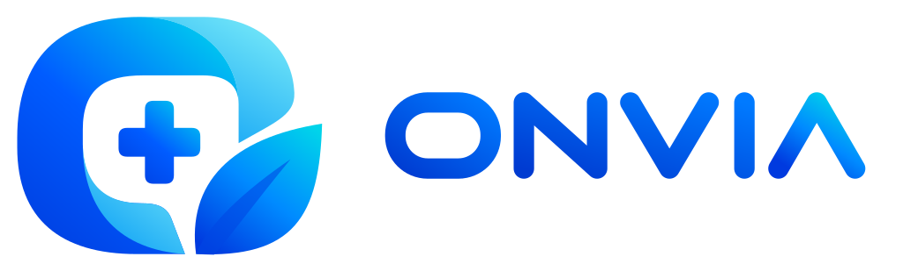
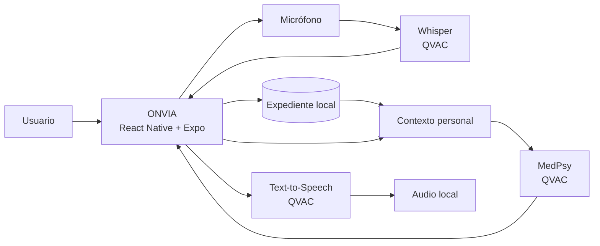
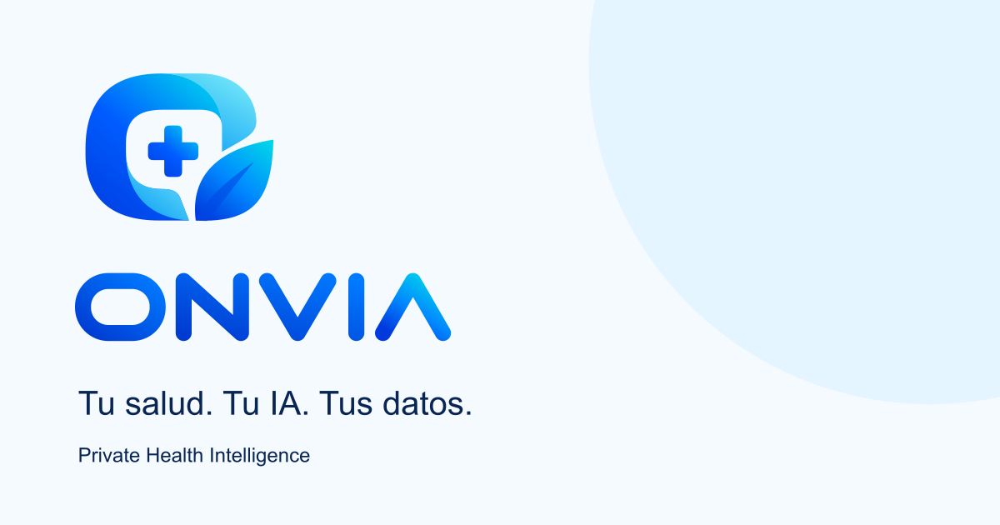

<div align="center">



### Tu salud. Tu IA. Tus datos.

**Private Health Intelligence, powered locally by QVAC.**

<br>

[](#)
[](https://developer.android.com/)
[](https://github.com/facebook/react-native)
[](https://github.com/expo/expo)
[](https://github.com/microsoft/TypeScript)
[](https://github.com/tetherto/qvac)
[](LICENSE)

[▶ Ver video](https://youtu.be/J3gRfPEGxGw?si=gu2BiskeHpbBh7uA) ·
[Características](#-características) ·
[Cómo funciona](#-cómo-funciona) ·
[Empezar](#-empezar) ·
[Hackathon](#-declaración-del-hackathon)

</div>

---


## 🩺 Sobre ONVIA

En Latinoamérica, la historia de salud de una persona suele quedar fragmentada entre recuerdos, documentos, chats y distintas instituciones.

**ONVIA** convierte esa información en un expediente personal consultable desde el teléfono y le añade una capa de inteligencia privada: el usuario puede organizar su perfil, enfermedades, medicamentos e historial clínico, y luego conversar con un asistente que utiliza ese contexto **sin enrutar la inferencia a una API de IA en la nube**.

La idea central es simple:

> **El teléfono no es solo la interfaz: es la frontera privada de cómputo.**

ONVIA fue desarrollado como prototipo para el **Decentralized AI Hackathon — [ISD Summit](https://isdsummit.com/) Panamá 2026**.

---

## ✨ Características

- **Expediente personal local** — perfil, condiciones, medicamentos e historial clínico.
- **Asistente contextual de salud** — utiliza la información almacenada en el dispositivo para dar respuestas relevantes al usuario.
- **Dictado en español** — grabación de voz y transcripción local.
- **Texto a voz** — reproducción hablada de respuestas.
- **Preparación de modelos** — descarga, carga y progreso desde la propia aplicación.
- **Mapa de servicios de salud** — hospitales y farmacias sobre mapa de Panamá.
- **Arquitectura local-first** — la inferencia de IA presentada en el hackathon se ejecuta mediante QVAC en el dispositivo.
- **Android nativo** — aplicación React Native / Expo con módulos nativos y soporte `arm64-v8a`.

---

## 🎬 Demo

**Video oficial del hackathon:**  
▶ **[ONVIA](https://youtu.be/J3gRfPEGxGw?si=gu2BiskeHpbBh7uA)**


---

## 🧠 Cómo funciona



### Frontera de privacidad

ONVIA mantiene en el dispositivo:

- perfil;
- condiciones de salud;
- medicamentos;
- historial clínico;
- estado de preparación de la aplicación;
- contexto utilizado por el asistente.

La inferencia del asistente, la transcripción y la síntesis de voz se realizan mediante **QVAC** en el dispositivo.

La aplicación puede utilizar red para funciones **no relacionadas con inferencia**, como la descarga inicial de modelos o recursos necesarios por la aplicación.

---

## 🧰 Stack tecnológico

| Tecnología | Uso en ONVIA |
| --- | --- |
| [React Native](https://github.com/facebook/react-native) | Aplicación móvil |
| [React](https://github.com/facebook/react) | Interfaz de usuario |
| [Expo](https://github.com/expo/expo) | Tooling, módulos nativos y build |
| [Expo Router](https://github.com/expo/expo/tree/main/packages/expo-router) | Navegación |
| [TypeScript](https://github.com/microsoft/TypeScript) | Lenguaje principal |
| [QVAC](https://github.com/tetherto/qvac) | Runtime de inferencia local |
| [OpenAI Whisper](https://github.com/openai/whisper) | Tecnología/modelo de reconocimiento de voz, utilizado mediante QVAC |
| [MapLibre React Native](https://github.com/maplibre/maplibre-react-native) | Mapas |
| [Expo SQLite](https://github.com/expo/expo/tree/main/packages/expo-sqlite) | Persistencia local |
| [AsyncStorage](https://github.com/react-native-async-storage/async-storage) | Estado local persistente |

Las versiones exactas utilizadas por el build se encuentran en [`package.json`](package.json).

### Modelos

| Capacidad | Modelo | Ejecución |
| --- | --- | --- |
| Asistente de salud | **MedPsy 1.7B** |
| Voz a texto | **Whisper Spanish Tiny** |
| Texto a voz | **Supertonic Multilingual** |

---

## 🚀 Empezar

### Requisitos previos

Para ejecutar ONVIA desde código fuente se necesita:

- Node.js compatible con Expo 54;
- npm;
- Java/JDK compatible con el toolchain Android;
- Android SDK;
- Android NDK;
- dispositivo Android físico `arm64-v8a`;
- depuración USB habilitada.

> ONVIA utiliza QVAC, por lo que no funciona en emuladores.

### Instalación

```bash
git clone https://github.com/Vortecsmaster/Onvia.git
cd Onvia
npm install
```

### Ejecutar en Android

```bash
npx expo run:android --device
```

### Comprobaciones

```bash
npm run typecheck
npm run lint
npm test
```

### APK

Si el repositorio final conserva el script de release:

```bash
npm run build:apk
```

> La ruta y nombre exactos del APK deben corresponder al artefacto de la release final.

---

## 📱 Uso

1. Abre ONVIA.
2. Prepara los modelos la primera vez.
3. Completa el perfil.
4. Registra condiciones, medicamentos o notas de historial.
5. Abre el asistente.
6. Escribe una pregunta o utiliza el micrófono.
7. Revisa la transcripción antes de continuar.
8. Recibe la respuesta generada localmente.
9. Reproduce la respuesta por voz si lo deseas.

ONVIA también permite consultar lugares de salud desde el mapa de Panamá.

---

## 🗂️ Estructura del proyecto

```text
.
├── assets/
├── docs/
├── plugins/
├── src/
│   ├── app/          # Expo Router
│   ├── components/   # Componentes reutilizables
│   ├── data/         # Datos locales
│   ├── domain/       # Modelos y contratos
│   ├── features/     # Flujos y pantallas
│   ├── locales/      # Textos de la UI
│   ├── providers/    # Servicios compartidos
│   └── services/     # QVAC, SQLite, audio y ubicación
├── tests/
├── app.json
├── package.json
└── tsconfig.json
```

A alto nivel:

```text
Route → Screen → Controller → Contract → Adapter
```

---

## 🏁 Declaración del hackathon

ONVIA participa en el **Decentralized AI Hackathon — [ISD Summit](https://isdsummit.com/), Panamá, 9–11 de septiembre de 2026**.


### Cumplimiento técnico

| Requisito | ONVIA |
| --- | --- |
| Uso genuino de QVAC | QVAC se utiliza como runtime para las capacidades de IA local |
| Inferencia on-device | MedPsy, Whisper y TTS se ejecutan mediante QVAC en el dispositivo |
| Sin inferencia en la nube | ONVIA no utiliza una API remota de IA como fallback para el flujo presentado |
| Video de entrega | [YouTube](https://youtu.be/J3gRfPEGxGw?si=gu2BiskeHpbBh7uA) |
| Base preexistente declarada | Sí, en la siguiente sección |

### Base preexistente

ONVIA utiliza tecnologías, librerías, modelos y ejemplos públicos de terceros, incluyendo los elementos identificados en la sección [Stack tecnológico](#-stack-tecnológico). Estos componentes conservan su autoría y sus respectivas licencias y no se presentan como trabajo original del equipo.

### Trabajo realizado durante el hackathon

Durante la ventana del hackathon el equipo trabajó sobre la base declarada para desarrollar, integrar y validar la solución presentada, incluyendo:

- integración del runtime QVAC en Android;
- ejecución local de MedPsy;
- preparación y carga de modelos desde la aplicación;
- captura de audio;
- transcripción local en español mediante Whisper;
- síntesis de voz local;
- conexión de las capacidades de IA con los flujos de ONVIA;
- contextualización de la conversación con el expediente almacenado localmente;
- estabilización y validación de la integración Android/QVAC;
- preparación de la demostración funcional.

Durante el desarrollo se utilizaron asistentes y agentes de programación basados en IA.

---

## 🔒 Privacidad y seguridad

ONVIA fue diseñado con una arquitectura **local-first**, pero esta versión sigue siendo un prototipo de hackathon.

La aplicación **no afirma** implementar todavía:

- cifrado de expediente a nivel de aplicación;
- autenticación multiusuario;
- backup cifrado;
- sincronización segura entre dispositivos;
- interoperabilidad con expedientes institucionales;
- cumplimiento regulatorio médico.

Estas capacidades forman parte del trabajo necesario para convertir el prototipo en un producto de producción.

---

## ⚠️ Limitaciones

- ONVIA es un prototipo y no un sistema clínico certificado.
- La calidad y velocidad de inferencia dependen del hardware.
- La preparación inicial puede requerir conexión para descargar modelos.
- No existe sincronización de expediente entre dispositivos.
- No existe backend propio para el expediente personal.
- El mapa y los datos de establecimientos deben verificarse antes de utilizarlos para decisiones reales.
- Las respuestas de un modelo de IA pueden contener errores o información incompleta.

---

## 🩻 Aviso médico

**ONVIA no reemplaza consejo, diagnóstico ni tratamiento médico profesional.**

El asistente ayuda a organizar y consultar información personal de salud. Ante síntomas, emergencias o decisiones médicas, consulta a un profesional de salud calificado o al servicio de emergencia correspondiente.

---

## 🗺️ Roadmap

- [x] Expediente personal local
- [x] Asistente de salud on-device
- [x] Dictado por voz
- [x] Síntesis de voz
- [x] Mapa de servicios de salud
- [ ] Cifrado del expediente a nivel de aplicación
- [ ] Importación estructurada de documentos médicos
- [ ] Portabilidad segura del perfil entre dispositivos
- [ ] Mayor cobertura de fuentes y proveedores de salud
- [ ] Endurecimiento para uso fuera de un entorno de demostración

---

## 🤝 Contribuir

Las contribuciones son bienvenidas.

1. Haz un fork del repositorio.
2. Crea una rama para tu cambio:

```bash
git checkout -b feature/nombre-del-cambio
```

3. Haz tus cambios y ejecuta las comprobaciones:

```bash
npm run typecheck
npm run lint
npm test
```

4. Envía tu rama y abre un Pull Request.

Para cambios importantes, abre primero un issue para discutir el enfoque.

---

## 👥 Equipo

**ONVIA**

- Jaime Villafane
- Roberto J. Cerrud
- Mario Rios

---

## 📄 Licencia

Este proyecto se distribuye bajo la licencia **GNU General Public License v3.0**.

Consulta [`LICENSE`](LICENSE) para los términos completos.

Las librerías, modelos, ejemplos y otros componentes de terceros conservan sus respectivas licencias.

---

## 🙏 Agradecimientos

ONVIA existe gracias al trabajo de numerosos proyectos y comunidades open source, entre ellos:

- [QVAC](https://github.com/tetherto/qvac)
- [React Native](https://github.com/facebook/react-native)
- [Expo](https://github.com/expo/expo)
- [TypeScript](https://github.com/microsoft/TypeScript)
- [OpenAI Whisper](https://github.com/openai/whisper)
- [MapLibre](https://github.com/maplibre)

---

<div align="center">

<p align="center">
  
</p>


[▶ Ver video](https://youtu.be/J3gRfPEGxGw?si=gu2BiskeHpbBh7uA)

</div>
